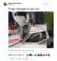
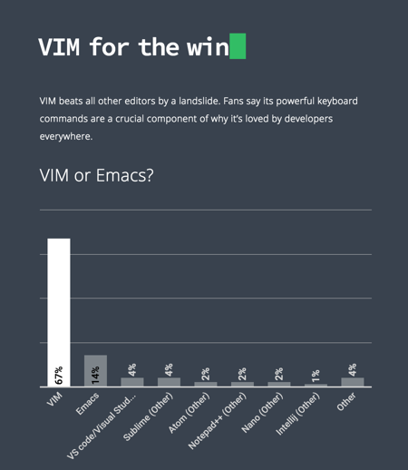

---
## Do you even

---
## Why hate Vim?
- counterintuitive |
- learning wall |
---
## The Learning Wall
_viewed 1,392,379 times_

@title[Quitting Vim]

<br />
<span style="font-size:0.5em">[Stack Overflow: Helping One Million Developers Exit Vim](https://stackoverflow.com/questions/11828270/how-to-exit-the-vim-editor)</span>

@fa[arrow-down]

+++
@title[Quitting Vim]


+++
@title[Quitting Vim]

---
## Why Learn Vim?
- you dislike the mouse |
- context switch - it slows you down |
- commands will just "work" elsewhere |
- it sneakily opens |
---
@title[Vim Usage]

<br />
<span style="font-size:0.5em">[2018 Developer Skills Report - HackerRank](http://research.hackerrank.com/developer-skills/2018/)</span>
---
## Vim Philosophy
<ul class="none">
  <li>@fa[hand-o-right] "Vim grammar" (commands are self-documenting)</li>
  <li>@fa[hand-o-right] Modes: normal, insert, visual, command.</li>
</ul>
---
## Where to Start
<div class="terminal">
  $ brew install vim
</div>

...what next?
---
## Configuration Time
- get Vundle  - install plugins with one command
- `touch ~/.vimrc`
- enable arrows in insert mode
- enable mouse
- remap ESC
---
## Your .vimrc
Edit directly from Vim:
```
:edit or :e $MYVIMRC
:source $MYVIMRC
```

Optional, but good to have:
```
alias vimrc='vi ~/.vimrc'
```

@fa[arrow-down]

+++?code=assets/vimrc-sample&lang=bash&title=Source: .vimrc

@[43](Enable mouse.)
@[74](Show line number.)
@[86](Highlight matches when searching)
@[159-161](Delete, not cut!)
---
## Exit Vim
```
:w
:q
:wq
:wa
```

Comfort settings:
```
command! -bar -bang Q quit<bang>
command! W w
command! WQ wq
command! Wq wq
command! Q q
```
---
## Vim Modes
- normal, *Esc*
- insert, *i*
- visual, *v*
- command, *:*
---
## Command Mode
- execute commands (:q, :vs, :wa)
- settings on the fly
- operate on word/line/ranges without moving the cursor (:5,10d)
- interact with the command line (:source)

@fa[arrow-down]

+++
Some examples:
```
:m17
:t17
:!ls // fg
```
---
## Selecting Text
```
v // selects a character
V // selects line
o  // moves end / start selection
```

Other examples:
```
vw
vit
vi"
vi(
vt;
```
---
## Editing Text
```
i, I // insert
c, C // change
a, A // append
o, O // open a line
```
---
## Deleting Text
```
d, dd
d/vim
r // replace a char
x // delete a char
```
From insert mode:
```
Ctrl h // char
Ctrl w // word
Ctrl u // line
```
---
## Undo, Redo
It's simple!
```
u
Ctrl r
```
---
## Moving Around
In a file
```
h j k l
w, b
%  // matching brackets
:n // move to line num
0 // beginning of line
$ // end of line
f <char>
; // next match
, // prev match
```

In the window:
```
H
M
L
```
---
## Productivity
```
5u // undo 5 times
xp // swap characters
:sort
:12,15norm dit // norm command
Ctrl a, Ctrl x // increment / decrement
```

Open file at line 21:
```
vi +21 file.js -c d
```
---
## Pain Points
<ul class="none">
  <li>@fa[thumbs-down] Delete is actually cut</li>
  <li>@fa[thumbs-down] Copy and paste needs some work</li>
  <li>@fa[thumbs-down] Global search and replace</li>
  <li>@fa[thumbs-down] Typos</li>
</ul>

@fa[arrow-down]

+++
## Things Will Go Wrong


<p class="error">:s/y/col</p>
<p class="success">:s/\&lt;y/&gt;/col</p>
---
## Resources
<ul class="none">
 <li>@fa[keyboard-o] [Open Vim](http://www.openvim.com/tutorial.html)</li>
 <li>@fa[github-alt] [Vim Galore](https://github.com/mhinz/vim-galore)</li>
 <li>@fa[link] [Vim gifs](https://vimgifs.com/)</li>
 <li>@fa[link] [Vim cheatsheet](https://vim.rtorr.com/)</li>
 <li>@fa[gamepad] [Vim adventure](https://vim-adventures.com/)</li>
 <li>@fa[video-camera] [Learn to Use Vim](https://egghead.io/courses/learn-to-use-vim)</li>
 <li>@fa[book] [Mastering Vim](https://jovicailic.org/mastering-vim-quickly/)</li>
</ul>

@fa[arrow-down]

+++?image=/assets/img/keyboard.jpg
@title[Keyboard Cover]
