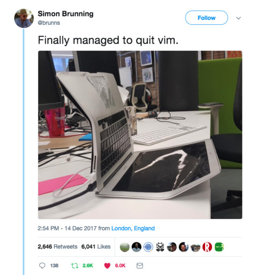

---
## Do you even

---
## Vim Philosophy
* @fa[hand-right] "Vim grammar" (commands are self-documenting)
* @fa[hand-right] Modes: normal, insert, visual, command.
---
## Why hate Vim?
- counterintuitive |
- does not seem to respond |
- learning wall |
---
## The Learning Wall
_viewed 1,392,379 times_

@title[Quitting Vim]


<span style="font-size:0.5em">[Stack Overflow: Helping One Million Developers Exit Vim](https://stackoverflow.com/questions/11828270/how-to-exit-the-vim-editor)</span>

@fa[arrow-down]

+++
@title[Quitting Vim]


---
## Why learn Vim?
- you dislike the mouse |
- context switch |
- different mindset |
- commands will just "work" elsewhere |
- it sneakily opens |
---

@title[Vim Usage]
---
## Vim Features
Pretty much everything you do with your favourite editor, plus:
- simple arithmetic |
- interact with the shell |
- save text into registers |
- built-in version control |
---
## Where to Start
@fa[terminal] _brew install vim_

...what next?
---
## Configuration Time
* get Vundle  - install plugins with one command
* `touch ~/.vimrc`
* enable arrows in insert mode
* enable mouse
* set your leader key
* remap ESC
---
## Your .vimrc
Edit directly from Vim:
```
:edit or :e $MYVIMRC
:source $MYVIMRC
```

Optional, but good to have:
```
alias vimrc='vi ~/.vimrc'
```
+++?code=assets/vimrc-sample&lang=bash&title=Plugins or Native Features?

@fa[arrow-down]

@[9-24](Plugins)

@fa[arrow-down]

+++?code=assets/vimrc-sample&lang=bash&title=Set your preferences

@fa[arrow-down]

@[43](Enable mouse), @[74](Show line number), @[86](Highlight matches when searching)

@fa[arrow-down]

+++?code=assets/vimrc-sample&lang=bash&title=Map key combinations

@[151-155](iTerm shortcuts)

+++?code=assets/vimrc-sample&lang=bash&title=Change behaviour
@[159-161](Delete, not cut)
---
## Vim Modes
* normal
* insert
* visual
* command
---
## Command
* execute commands (:q, :vs, :wa)
* operate on word/line/ranges without moving the cursor (5,10d)
* interact with the command line (:source)
---
## Visual
---
## Insert
---
## Vim Grammar
// TODO examples, like dw, ciw
---
## Exit Vim
```
:w
:q
:wq
:wa
```

Comfort settings:
```
command! -bar -bang Q quit<bang>
command! W w
command! WQ wq
command! Wq wq
command! Q q
```
---
## Autocomplete
---
## Productivity
```
5u // undo 5 times
```
---
## Pain points
- @fa[thumbs-down] Delete is actually cut |
- @fa[thumbs-down] Copy and paste can be tricky to setup |
- @fa[thumbs-down] Global search and replace |
- @fa[thumbs-down] Typos |

@fa[arrow-down]

+++
Here is a replace gone wrong:


<p class="error">:s/y/col</p>
<p class="success">:s/\<y\>/col</p>

The fun includes: committng files called ":w", and much more...
---
## Resouces
* [Open Vim](http://www.openvim.com/tutorial.html) @fa[keyboard-o]
* [Vim Galore](https://github.com/mhinz/vim-galore) @fa[github-alt]
* [Vim gifs](https://vimgifs.com/)
* [Vim cheatsheet](https://vim.rtorr.com/)
* [Vim adventure](https://vim-adventures.com/) @fa[gamepad]
* [Learn to Use Vim](https://egghead.io/courses/learn-to-use-vim) @fa[video-camera]
* [Mastering Vim](https://jovicailic.org/mastering-vim-quickly/) @fa[book]

@fa[arrow-down]

+++?image=/assets/img/keyboard.jpg
@title[Keyboard Cover]
